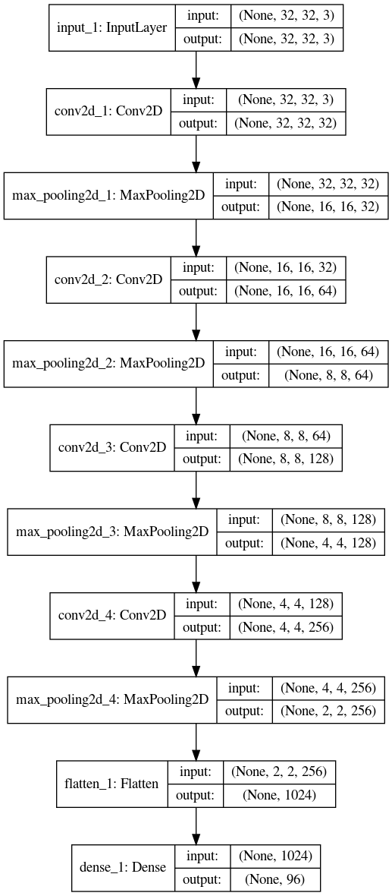
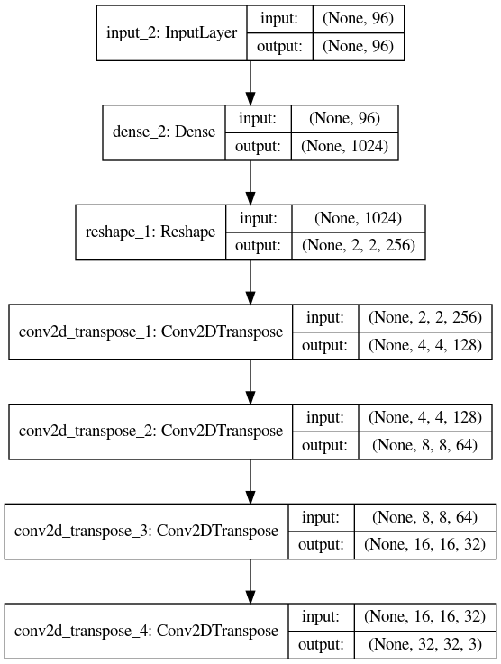

<h1> Channel-Specific Autoencoders </h1>

An <a href= "https://en.wikipedia.org/wiki/Autoencoder"> Autoencoder </a> is an Artifical Neural Network that is trained to "encode" a given input into a specified latent space, and conversely reconstruct input from this latent space by "decoding" it. The application of such neural networks range all the way from data compression to denoising. 

 

<h2>Traditional Autoencoder</h2>

 An Autoencoder for images works in two phases. A encoding phase, where the image is "encoded" into a particular latent space size, as shown for a 32x32x3 image below: 
 

 And a decoding phase, where the Neural Network "decodes" the entire image back using the latent code it was intially crunched into, as seen below:
 

 As evidenced above, the entire image is fed into the Autoencoder at one go, to encoder and decode from a single latent space

