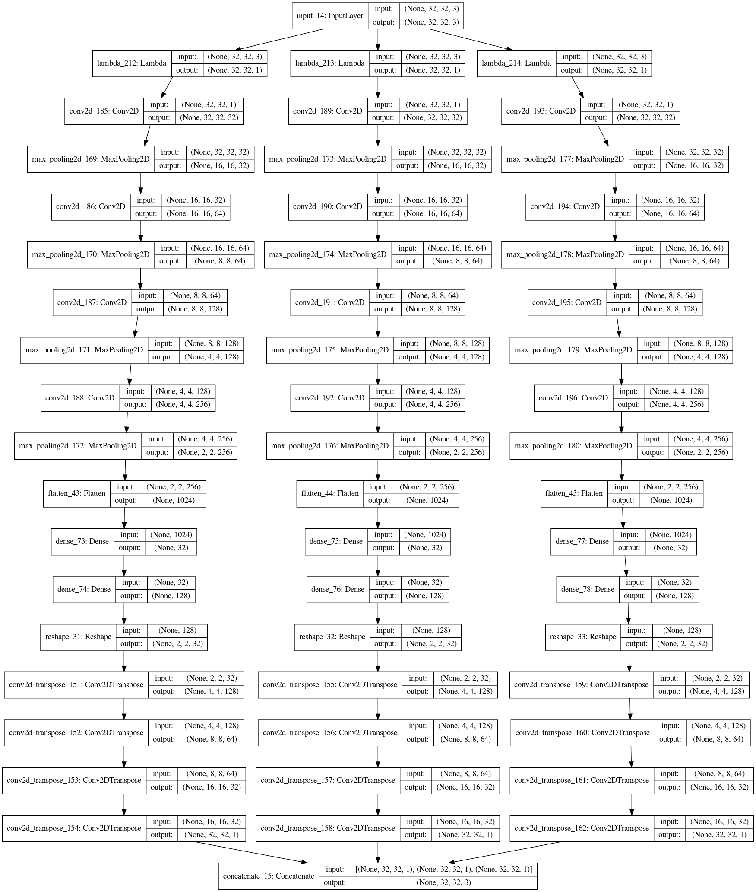
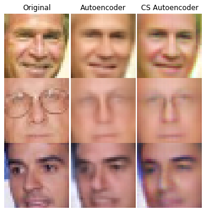
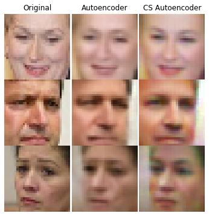
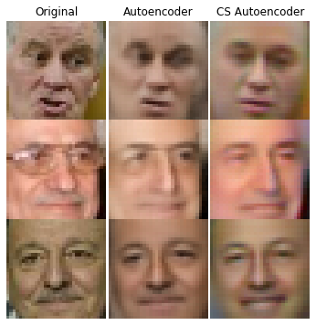
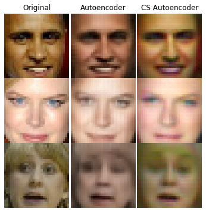

<h1> Channel-Specific Autoencoders </h1>

An <a href= "https://en.wikipedia.org/wiki/Autoencoder"> Autoencoder </a> is an Artifical Neural Network that is trained to "encode" a given input into a specified latent space, and conversely reconstruct input from this latent space by "decoding" it. The application of such neural networks range all the way from data compression to denoising. 

 

<h2>Traditional Autoencoder</h2>

 An Autoencoder for images works in two phases. A encoding phase, where the image is "encoded" into a particular latent space size, as shown for a 32x32x3 image below: 
 

 And a decoding phase, where the Neural Network "decodes" the entire image back using the latent code it was intially crunched into, as seen below:
 

 As evidenced above, the entire image is fed into the Autoencoder at one go, to encoder and decode from a single latent space.

<h2> Channel-Specific-Autoencoder </h2>

 My design of a Channel-Specific-Autoencoder involves splitting the image into seperate colour channels of R, G, and B and feeding them to three seperate encoders to encoder into separate latent-spaces and decode the individual channels from seperately, and stack together to reconstruct the entire image. A depiction of it can be seen below: 
  

  

  
<h3> The Motivation </h3>

 The primary motivation for such an architecture was to "divide labour". As opposed to having a single autoencoder reconstruct the entire image, the proposed model "outsources" reconstructing individual colour channels to 3 separate autoencoders, thereby working in unison to generate the entire image. 

<h2>Comparative Results: </h2>

 A few of the results can be seen below: 

 </img>
 </img>
 </img>
 </img>

 

 As seen in a lot of the results, the colour in the CS-Autoencoder appear more "true" compared to a Traditional Autoencoder 

